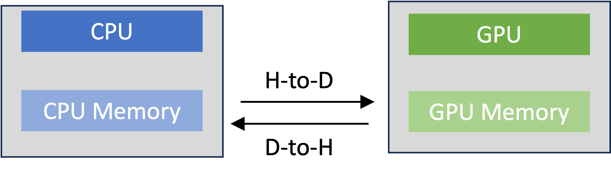

# Lesson 6: Host-Device Memory and Device Kernels

Now, let's learn about Umpire's different memory resources and, in
particular, those used to allocate memory on a GPU. 

Each computer system has distinct places in which the system
will allow you to allocate memory. For example, most GPU systems have distinct
processors and memory spaces called *host* and *device*. Host refers to the
CPU and its memory space. Device refers to the GPU and its memory space. Host
and device memory spaces are physically separate and data must be copied between
them. This is illustrated in the figure.

<figure>

</figure>

Understanding how to manage the different memory types is crucial for
efficient GPU programming. GPU programming models provide routines to
allocate/deallocate memory in either space, copy data between spaces, etc.

In Umpire's world, distinct places where memory allocation can be done are 
called **memory resources**. A memory resource can correspond to a hardware
resource, but can also be used to identify memory with particular access and/or
performance characteristics, like *pinned* memory in a GPU system. Umpire
creates predefined **allocators** for each available resource on a system
when it is configured to build. All allocators can be accessed using the 
`ResourceManager::getAllocator` method.

For this lesson, two memory resources are important:

- "HOST": CPU memory, like `malloc`.
- "DEVICE": device memory, and a "::<N>" suffix can be added to request memory on a specific device.

There are more memory resources that Umpire offers. Check out the list of
memory resources at the bottom of this README!

Now, let's learn how to use Umpire's operations to copy data
between CPU and GPU memory in a portable way, using Umpire's memory resources.

In `06_raja_umpire_host_device.cpp`, we create an allocator for the GPU with:
```  
auto allocator = rm.getAllocator("DEVICE");
```

and a separate allocator on the CPU with:

```
  auto host_allocator = rm.getAllocator("HOST");
```

We will initialize the data on the CPU, but we want to do computations on
the GPU. To do this, we use Umpire **operators**. Recall from lesson 3 that
we learned how to use Umpire's `memset` operator. This lesson
builds on top of that to show other available operators.

Umpire provides a number of operations implemented as methods on the
`ResourceManager`. These typically take pointer and size arguments, but you do
not need to tell Umpire which Allocator each pointer came from. Umpire keeps
track of this and will call the appropriate underlying vendor function.

The copy method has the following signature:

```
void umpire::ResourceManager::copy (void* dst_ptr, void * src_ptr, std::size_t size = 0)	
```

*Note:* The destination is the first argument.

In the file `06_raja_umpire_host_device.cpp`, there is a `TODO` comment where you should insert two copy
calls to copy data from the CPU memory to the DEVICE memory.

You will also find that we are adjusting the `RAJA::forall` to now work on the GPU.
In order for this to happen, we need a few extra things. First, we create a 
`CUDA_BLOCK_SIZE` variable to tell RAJA how big we want our CUDA thread-blocks to be.
Since there are 32 threads in a warp, 256 tends to be a good block size value to try. 
Other sizes will work too, such as 128 or 512. This just depends on your GPU.

Next, the `RAJA::forall` needs a CUDA execution policy. We will use the 
`RAJA::cuda_exec` policy and specialize it with the `CUDA_BLOCK_SIZE` variable
we created by giving that as a template parameter. Finally, as we are filling in 
the lambda expression for the `RAJA::forall`, we need to specify where it will 
reside in GPU memory. This can be done directly with the `__device__` annotation 
or by using the `RAJA_DEVICE` macro.

For more information about why we need these extra details as we prepare RAJA for the GPU,
be sure to check out the links at the bottom of this README.

When you are done editing the file, compile and run it:

```
$ make 06_raja_umpire_host_device
$ ./bin/06_raja_umpire_host_device
```
Want to learn more about Umpire memory resources? Check out the list below! You can also learn 
more by going to our online documentation on 
[Umpire Resources](https://umpire.readthedocs.io/en/develop/sphinx/tutorial/resources.html).

- "UM": unified memory that can be accessed by both the CPU and GPU.
- "PINNED": CPU memory that is pinned and will be accessible by the GPU.
- "DEVICE_CONST": constant, read-only GPU memory
- "FILE": mmapped file memory that is accessible by the CPU.
- "SHARED": Includes POSIX shared memory which can be accessible by the CPU or GPU depending
on what your system accommodates and the MPI3 shared memory that is accessible on the CPU.
- "UNKNOWN": If an incorrect name is used or if the allocator was not set up correctly.

More on RAJA GPU execution policies can be found here: [RAJA GPU Policies](https://raja.readthedocs.io/en/develop/sphinx/user_guide/feature/policies.html#gpu-policies-for-cuda-and-hip).

More information on CUDA programming concepts is available at these links:

* [CUDA Architecture](https://stevengong.co/notes/CUDA-Architecture)
* [CUDA Thread and Block Heuristics](https://cuda-programming.blogspot.com/2013/01/thread-and-block-heuristics-in-cuda.html)
* [CUDA C++ Programming](https://docs.nvidia.com/cuda/cuda-c-programming-guide/)

